# Assignment-06 Interface Design
## Project Description 
The purpose of this interface design is to test out the multiple interface design ideas that can be implemented into the reconstruction of Alaska's Department of Fish and Game.
I previously created a wireframe that outlined the websites features in order for users to test out its usability, based on two tasks they were asked to complete. Now I will digitize the wireframe/wireflow in order to implement more design features (ex.Typography,Color Scheme,Layout), so that I can run a user test and then see how much more I can adjust the designs on the webpage based on their feedback.  

Prototype link can be found <a href="https://www.figma.com/proto/xcE8uYadsSKRI0JRrVU0fS/Interface-Design?node-id=1%3A2&scaling=contain&page-id=0%3A1&starting-point-node-id=1%3A2&show-proto-sidebar=1"> here </a> (When on the prototype, screen size option should be set to "Fill- Scale up or down to fill")

## Layout
Below I've inserted the layout grid for the webpage. I struggled with this and will need to improve on the practice.

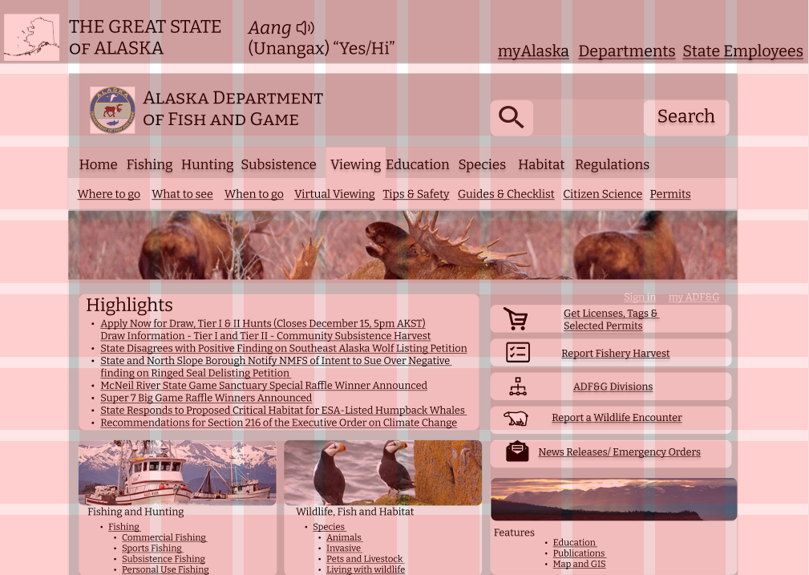 

## Typography 
Before finalizing a typeface I considered three variations for the Webpage. 

Roboto:  Prompt: 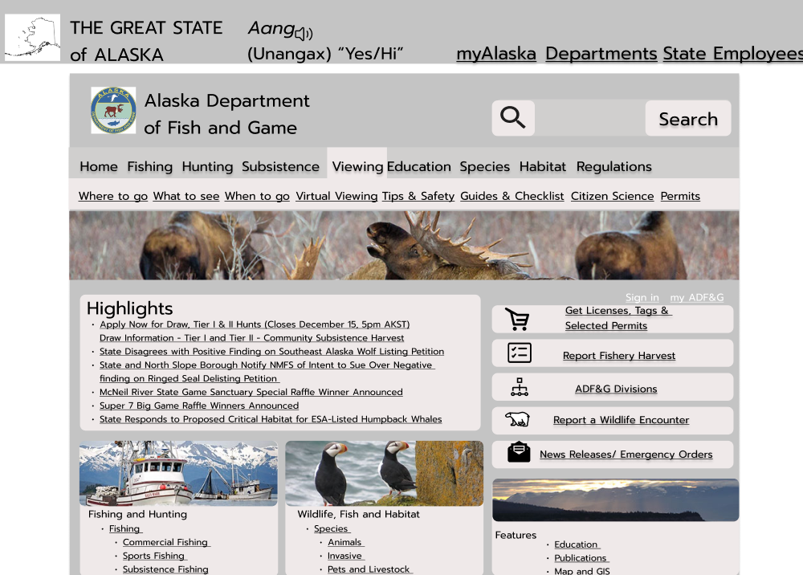 Bitter: 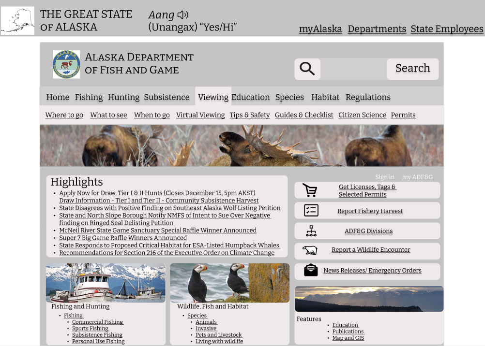

I decided to go with "Bitter" because the bigger text aligned more with the smaller text compared to the other typefaces. This lead the font-size of the body text to be 16px, font-size of title text 32px, Font-size of subtitles 24px, font-size of button text and drop down menu 18px, font-size of categories 20px. I also added drop shadows to all clickable text along with text that can be hovered over to let users know that they can interact with it with the mouse.

## Shape Variation
When it came down to the shape variation I was mainly focused on the clickable buttons. I first examined the webpage layout without any changes made to the shapes to see what shapes should be changed in the first place, this layout is demonstrated in Shape1. I then realized that I should make the 5 buttons, search bar, and viewing category have round corners being that those are items that the user can click as buttons, this is shown in Shape2. However, after making those changes to the layout the rounded items seemed not to fit in with the rest of the page making them stand out and making it seem like those are the only interaction points. So, I decide to make every item below the header rounded including the search bar thats in the header. This made it seem like the whole page is in sync now, but I still wanted to distinguish the clickable buttons so I decided to add drop shadows to all 5 buttons and the search button as well. Now all items on the page align with one another, but the user will be able to distinguish clickable buttons too, this is shown in Shape3.

Shape1: 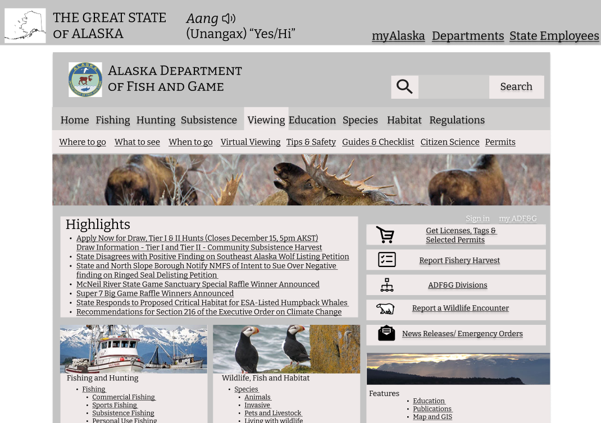 Shape2: 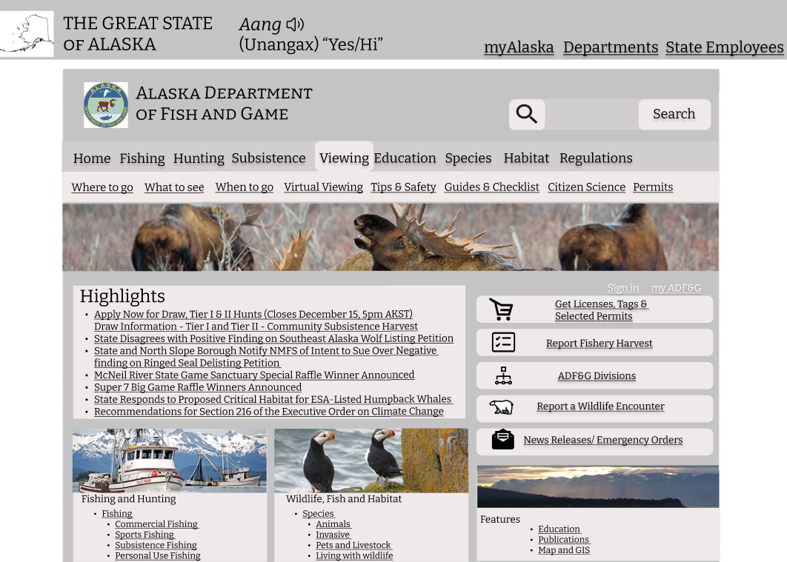 Shape3: 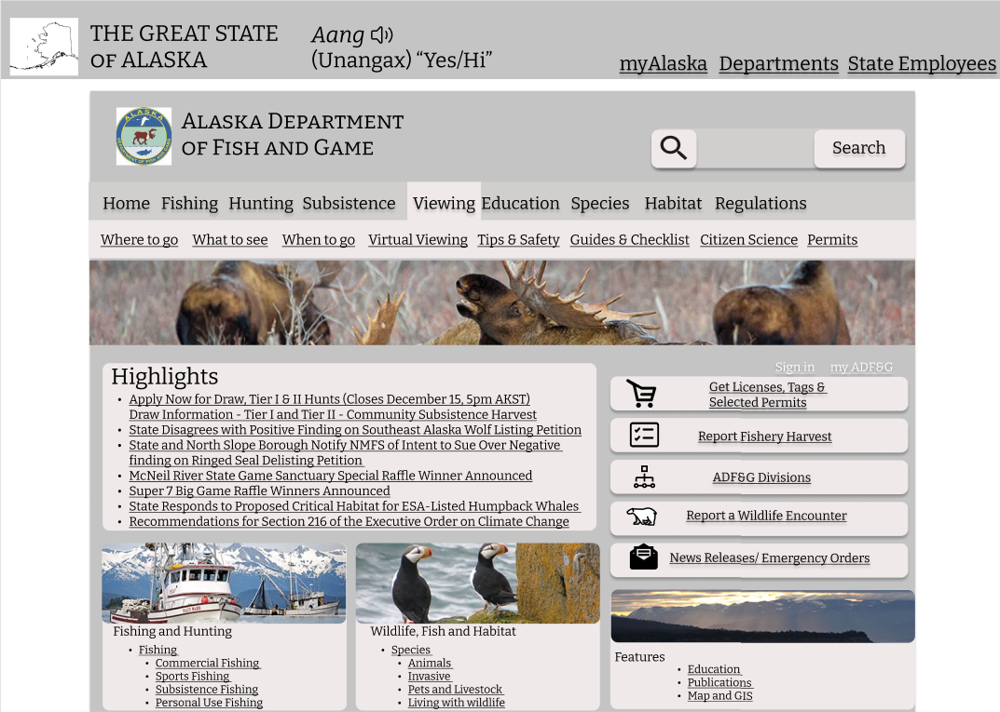

## Color Variation 
I first created a light mode color theme by extracting the colors from Alaska's Department of Fish and Game Logo. This color variation can be seen below.

Light Theme: 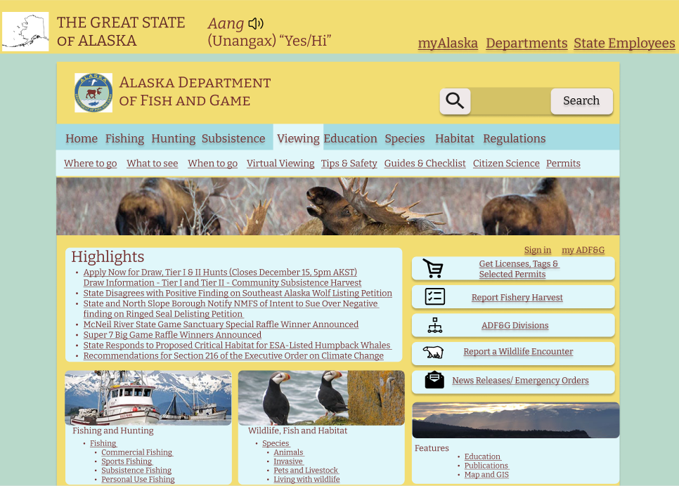

I then created a dark mode color them using the same method. And I knew I wanted to stick with a dark mode for the Webpage being that it is part of a governement website and it seemed more professional.This color variation can be seen below. 

Dark Theme: 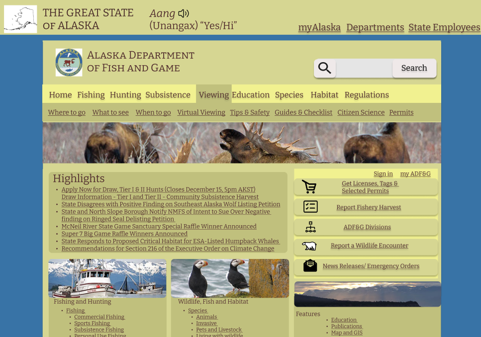

## Color Contrast Check
I completed a color coontrast check between background vs. text, background vs. button/icon; and button background vs. button labels the test results are shown below. 

Background vs. text: 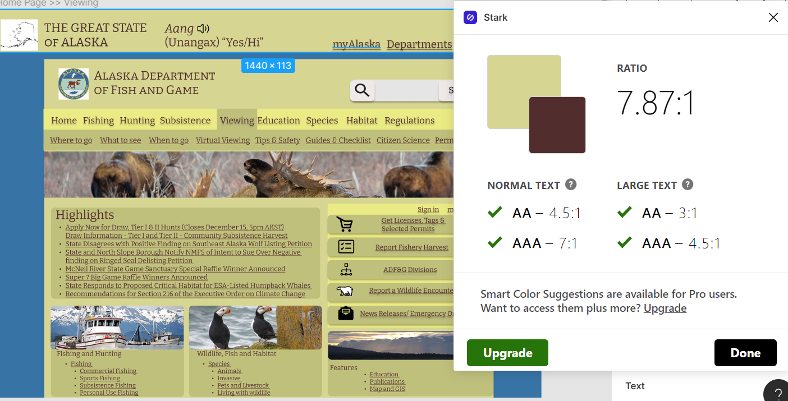 

Background vs. button/icon: 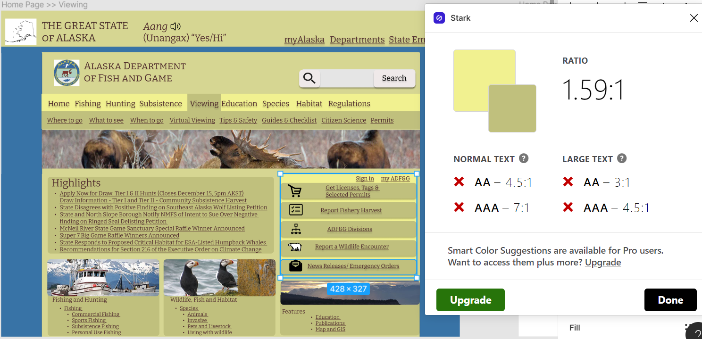 (After several attempts to change the colors in order for them to pass the test I was unable to do so, this is something I have to continue to work on) 

Button background vs. button labels: 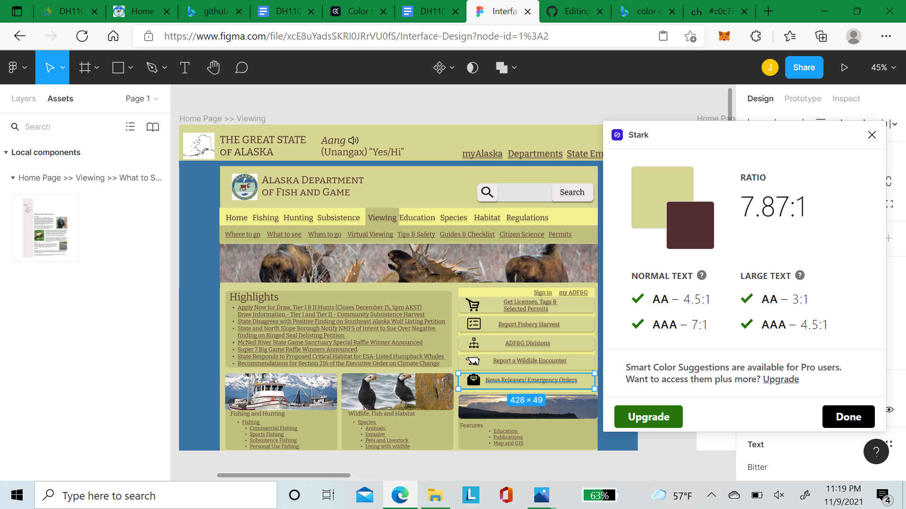
